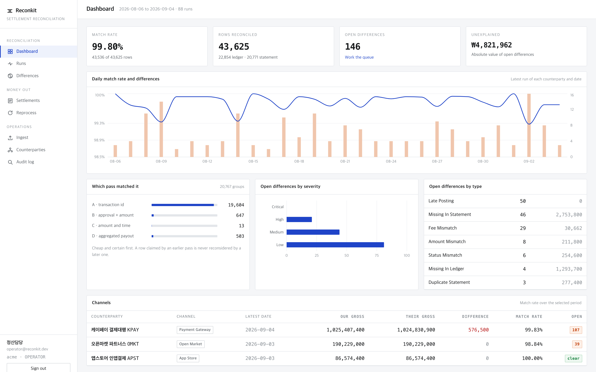
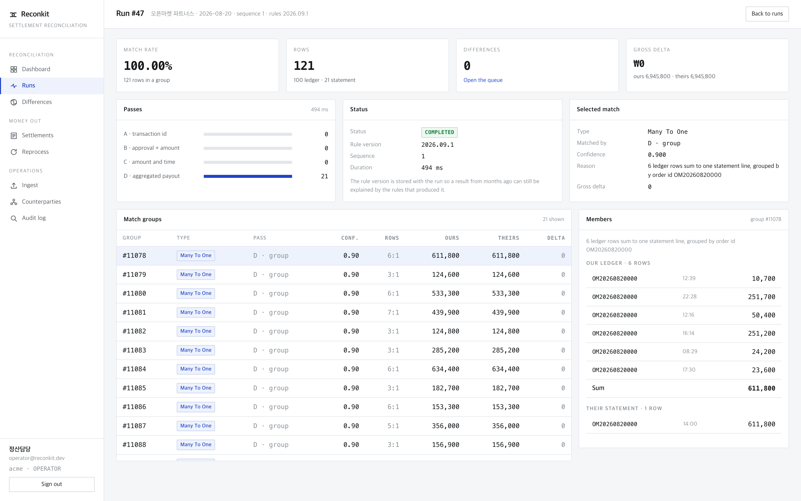
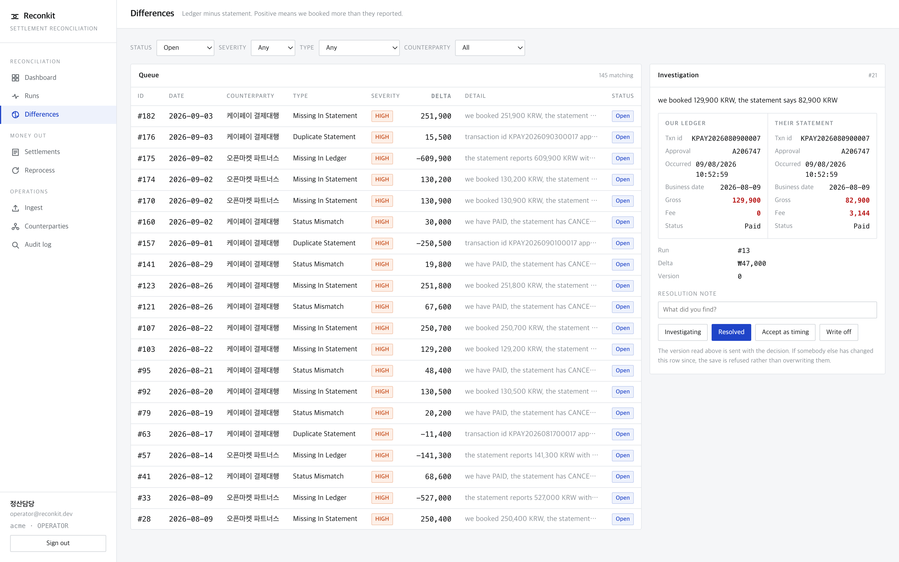
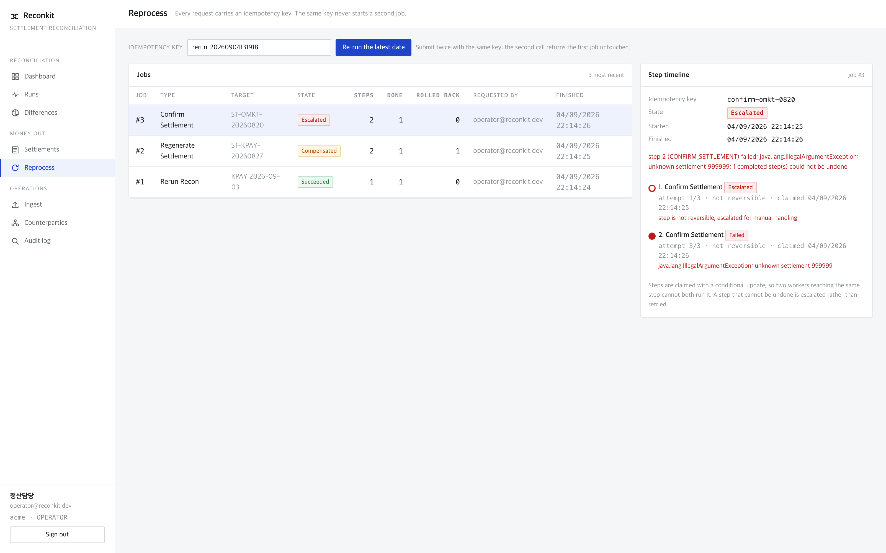
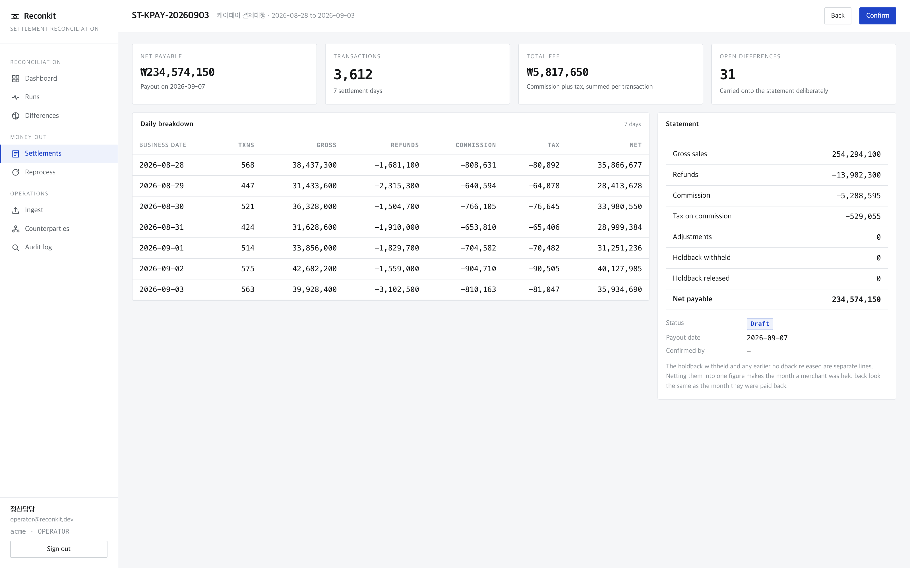

# Reconkit

A multi channel settlement reconciliation engine. It loads what we recorded and what the
counterparty reported, matches the two, explains the differences, and produces the
settlement statement that pays out.

Java 17, Spring Boot 3.3, MySQL 8, React admin. Runs locally with one Docker container
and no paid services.



## What it does

| | |
|---|---|
| Ingest | CSV upload and API load, one column mapping profile per counterparty, content hashed so the same file cannot be loaded twice |
| Reconcile | Four ordered passes: transaction id, composite key, amount and time scoring, aggregated payout |
| Detect | Nine difference types with severity rules, including fee errors measured against the contract |
| Reprocess | Idempotent jobs with a locked state machine and compensating rollback |
| Settle | Period statements with per transaction fees, tax, holdback and payout dates |
| Audit | Append only trail with before and after images and a request id |

Every table is tenant scoped from the first migration, so the same engine runs for one
organisation or many.

## Why it looks like this

I have been building software for thirteen years, ten of them wired into payments:
KSNET, KCP, and in app purchase, plus a kiosk with a card terminal bolted onto it. Most
of the decisions below are not from a textbook. They are the things that went wrong, or
nearly went wrong, on a live settlement run.

**Money is a long of minor units.** No `double`, and no `BigDecimal` either. Floating
point loses won at scale, and BigDecimal survives arithmetic but not the round trip
through the database: a scale set in one place and read back in another is how a fee
comparison starts reporting differences that are not there.
[`Money`](recon-domain/src/main/java/dev/sellerkit/reconkit/domain/money/Money.java)

**The business date is computed, never read from the file.** Our systems roll the day at
local midnight. A gateway rolls it at its own cutoff, often 23:30. Everything in that half
hour is on our books for today and on theirs for tomorrow. Without the cutoff as a field,
the engine reports the same block of transactions missing every night, always at the same
hour, always for amounts that add up. The file's own date column is not trusted, because
the file was written by the party being checked.
[`BusinessDateResolver`](recon-domain/src/main/java/dev/sellerkit/reconkit/domain/policy/BusinessDateResolver.java)

**Tolerance has two numbers.** An absolute floor absorbs the single unit of rounding every
percentage fee produces. A relative band absorbs the drift that scales with the amount.
One threshold cannot cover a 33 won transaction and a million won transaction without
either flooding the queue or hiding real losses.
[`Tolerance`](recon-domain/src/main/java/dev/sellerkit/reconkit/domain/money/Tolerance.java)

**An idempotency key is not enough to stop double processing.** The key stops a second
request from creating a second job. It says nothing about a second worker reaching a task
that is already in flight, and that is the case that pays a merchant twice. Every state
change is a conditional update guarded by the current state, and the caller only proceeds
when exactly one row changed.
[`TaskStore`](recon-reprocess/src/main/java/dev/sellerkit/reconkit/reprocess/TaskStore.java),
[`SagaRunner`](recon-reprocess/src/main/java/dev/sellerkit/reconkit/reprocess/SagaRunner.java)

**A step that cannot be undone is escalated, not retried.** Rollback runs in reverse over
the steps that actually succeeded, using the compensation recorded when each step was
created rather than one derived at rollback time. If money has already left, retrying the
reversal does not bring it back, so the job stops and a person is told.

**The settlement lock is a database row.** An in process lock protects one JVM and stops
protecting anything the moment a second instance starts, which is exactly when the traffic
that needs it arrives. Generation takes `SELECT ... FOR UPDATE` on a row keyed by tenant,
counterparty and period, and a unique constraint on the same key sits behind it.
[`SettlementService`](recon-app/src/main/java/dev/sellerkit/reconkit/app/service/SettlementService.java)

**Fees are computed per transaction and then summed.** Rounding once on a day's total is
not the same as rounding many times on small amounts, and the counterparty rounds per
transaction. Five hundred sales of 1,025 won at 2.20 percent cost 11,500 won in commission
per transaction and 11,275 won on the total: 225 won a day, every day, for a reason nobody
can find in the totals.
[`FeeCalculator`](recon-domain/src/main/java/dev/sellerkit/reconkit/domain/policy/FeeCalculator.java)

**Runs are immutable.** Re-running a date adds a sequence number, it does not edit the
previous result, so last night's reported numbers stay exactly as they were reported. A
unique key on (tenant, counterparty, date, sequence) is also what stops two schedulers
from producing two live runs for the same night.

## How the matching works

The passes run in order and a row claimed by an earlier pass is never reconsidered by a
later one. Cheap and certain wins, and it wins permanently.

| Pass | Key | Confidence |
|---|---|---|
| A | counterparty transaction id | 1.00 |
| B | approval number + amount, then order id + amount | 0.95 |
| C | amount within tolerance and time within the window, scored | 0.55 to 0.94 |
| D | N rows summing to one payout line, grouped by an identifier both sides carry | 0.90 |

Two decisions inside pass C. Candidates are found through an index on the signed amount
rather than by comparing every open row with every other: the leftovers are usually a small
fraction of the day, but on the night a counterparty ships a file with a regenerated
identifier column the leftovers are the whole day, and that is the night the quadratic
version stops finishing before the morning. And scoring is global rather than greedy per
row, because letting an early row take a line that a later row matched better reports the
difference against the wrong transaction.

Pass D deliberately does not search for any subset that adds up to the payout. That is the
subset sum problem, and with enough small transactions some subset always adds up, so the
matcher starts inventing groupings. Rows are grouped by an identifier both sides carry and
only a complete group is compared against a single line.



Every match group records which pass produced it, with what confidence, and a plain
sentence saying why. An operator will be asked to defend a number to a counterparty, and a
matcher that cannot answer "why were these tied together" is one nobody should trust with
money.

## Differences



Nine types: missing on either side, duplicated on either side, amount mismatch, fee
mismatch, late posting, status mismatch, currency mismatch.

The severity rules are the part that decides whether the queue gets read. A transaction
booked four minutes before the counterparty's cutoff and absent from tonight's file is not
a lost payment, it is tomorrow's first row, and it is filed as low. The same transaction
absent from the middle of the afternoon is a real hole. A status flip raises one finding
rather than three, because a cancellation on one side necessarily disagrees on the amount
and the fee as well.

Differences a later run explains are closed automatically and the closing run is recorded.
In the demo data 38 of them close themselves that way, which is what stops the queue
growing by the same forty rows every night until nobody reads it.

## Reprocess



Three outcomes, all reachable in the demo: a job that succeeds, a job whose second step
fails and whose first step is rolled back, and a job whose first step confirmed a
settlement and therefore cannot be rolled back at all. The third one escalates.

Submitting the same idempotency key twice returns the first job untouched rather than
starting a second.

## Settlements



Gross, refunds, commission, tax on commission, adjustments, holdback withheld, holdback
released, net payable. The holdback withheld and any earlier holdback released are separate
lines: netting them into one figure makes the month a merchant was held back look the same
as the month they were paid back.

The count of open differences is carried onto the statement. A period can balance to the
won while three transactions are still unexplained, and shipping the statement without
saying so is how a dispute starts.

## Modules

```
recon-domain      entities, money, policies. No Spring.
recon-ingest      CSV parsing and per counterparty column mapping profiles
recon-core        the engine: four passes and the difference classifier
recon-settlement  fee arithmetic, payout calendar, statement assembly
recon-reprocess   idempotent job runner and compensating saga
recon-app         Spring Boot: REST, JWT, tenancy, audit, Flyway
recon-admin       React + Vite + TypeScript admin
```

`recon-domain` and `recon-core` do not know Spring exists. The engine is a pure function
of the rows and the contract: same input, same output, every time. That is not a stylistic
preference. A reconciliation result may be disputed months later and the only defence is
re-running the exact night and getting the exact numbers back.

## Running it

```bash
docker compose -f deploy/docker-compose.yml up -d      # MySQL 8 on port 3307
RECONKIT_DEMO=true ./gradlew :recon-app:bootRun        # seeds a month of data on first run
npm --prefix recon-admin install && npm --prefix recon-admin run dev
```

The admin is on http://localhost:5173, the API on http://localhost:8080. Sign in as
`operator@reconkit.dev` or `admin@reconkit.dev`, password `reconkit`.

The demo seeder writes 30 days across three counterparties, roughly 44,000 rows, with a
known number of defects planted in it: 12 transactions missing from the counterparty's
file, 5 the counterparty reported and we never booked, 3 duplicated statement lines, 8
amount mismatches, 21 fee errors, 6 status flips and 40 late postings. The dashboard can be
checked against the generator rather than admired.

Two sample files are in `docs/samples` for the upload path: our export and the gateway's
file for a day the seeder does not cover, with three defects planted in the second one.

```bash
./gradlew test        # 40 tests, no database required
```

## What is deliberately not here

No billing. The tenant model, the per counterparty contract terms and the module
boundaries are the shape a subscription product needs, but nothing charges anyone and
nothing is metered. That is a decision, not an omission.

Fee schedules are flat rates plus a per transaction charge. Real gateways also price by
card brand, instalment count and merchant tier, which is a table rather than a field and is
the first thing this would need to run against a real contract.

Public holidays are injected rather than shipped. A holiday table baked into a jar is wrong
the year after it ships.

## Author

Sangyoon Lee. Thirteen years building web and mobile products, ten of them touching
payments: KSNET, KCP and in app purchase integrations, a kiosk with a card terminal, and
the settlement and refund paths behind them. Also seven JetBrains Marketplace plugins, two
VS Code extensions, two WordPress.org plugins and a Figma plugin, all shipped through their
own review processes.

lsy5718zzang@naver.com
